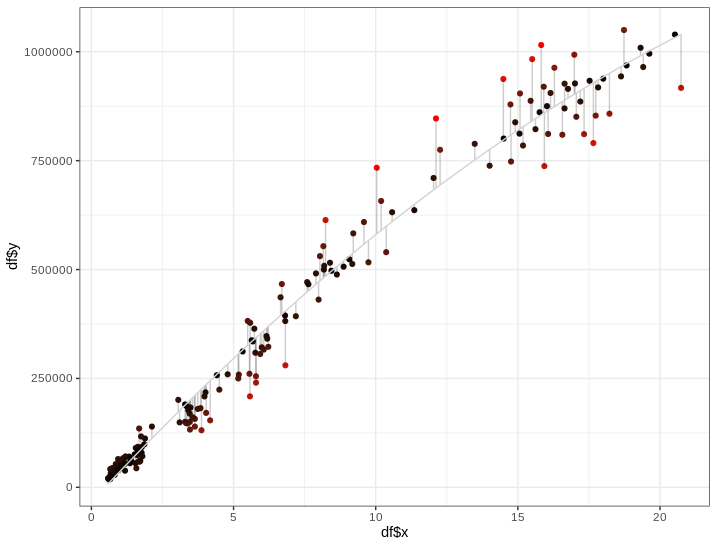

# basic_model_regression
R script to compare two different regression models with one variable and one label

### To select a good model with only one variable check:

1. F-statistic and p-value: F-statistic needs to be large, depending of n. for large n, F can be slightly more that 1, else it needs to be very large. The pvalue gives the significance of Fstatistic given n

2. R2 : the fraction of variance explained. In a simple model y ~x is the correlation between x,y. Adjusted R2 is used for polynomial functions.

3. RSE : RSE = sqr(RSS/(n-2)), where RSS is residual sum of squares. Is roughly how much your estimate deviates from the true regression line.
       It is an absolute measure on how well the model fits the data.

4. Check the residual plot: shouldn't have any shape and the points should all be close to the 0 horizontal line. If the residuals show a 'funnel shape',
       a transformation for the data is reccomended - log transform is the classical. Also outliers can show in the plot (leverage points)

5. MAE: mean absolute error - to be looked at in the test set : cross validation

6. RMSE: root mean squared error - to be looked at in the test set : cross validation

7. Bootstrapping : estimate the uncertainty of the coefficient and the model

In model selection you first define the model to test (linear should always be the gold standard)

First thing always look at your data!
Look at the F-statistic, R2 and RSE that give you a statistical measure on how well the model fit the data
Look at the statistical test to asses if y and x have a relationship  
Look at the diagnostic plots to identify biases and acuracy
Look at the RMSE, R2 and MAE in the test set via cross validation
Look at the train error and uncertainty of your coefficients with bootstrapping (at the end of the script!)

